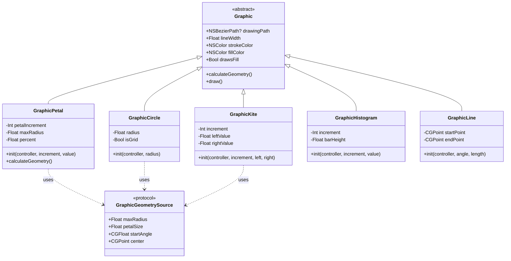
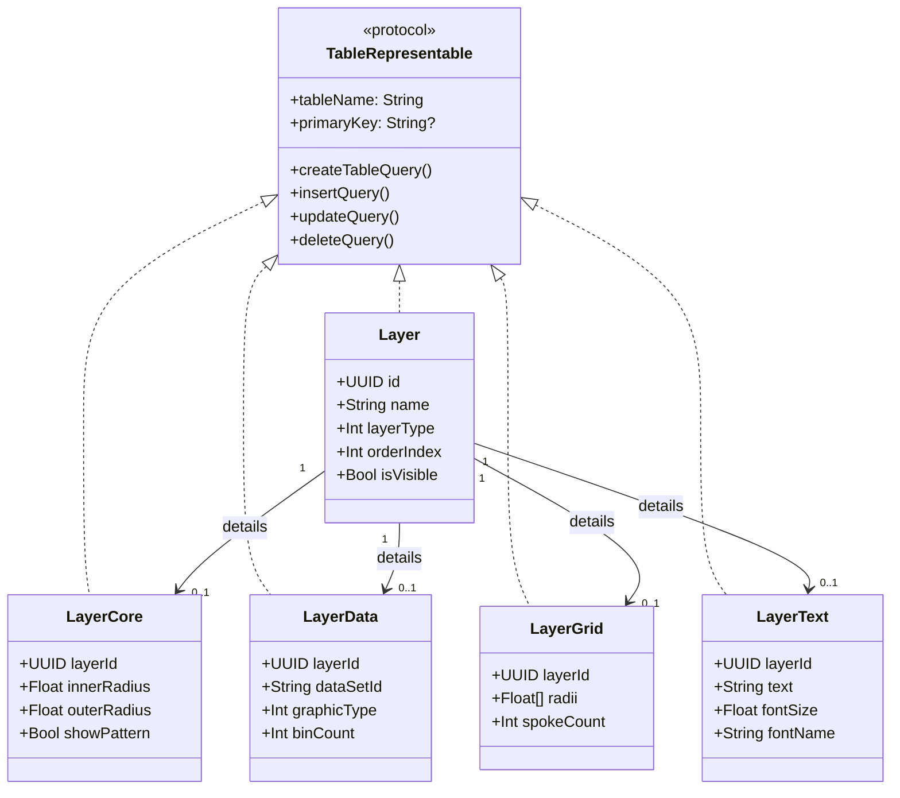
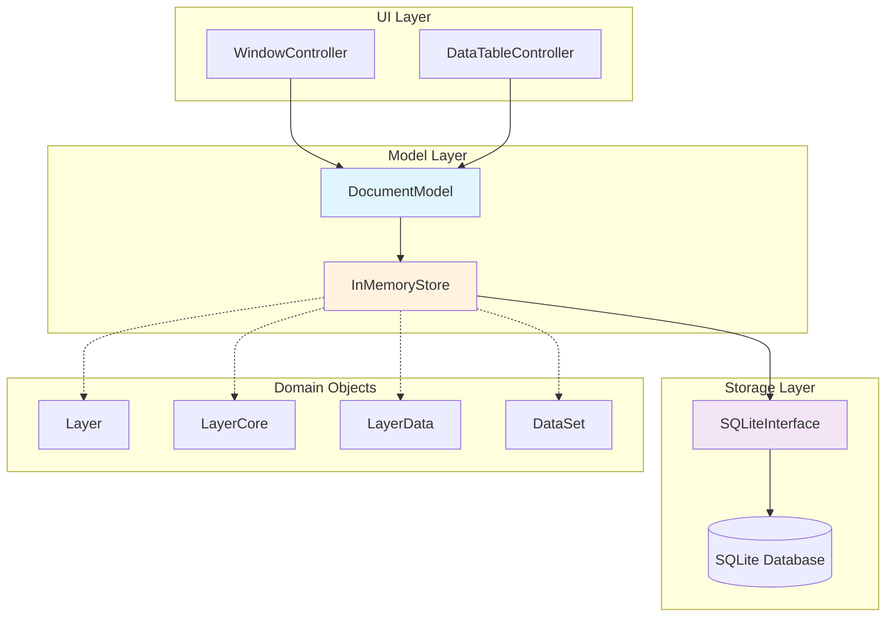
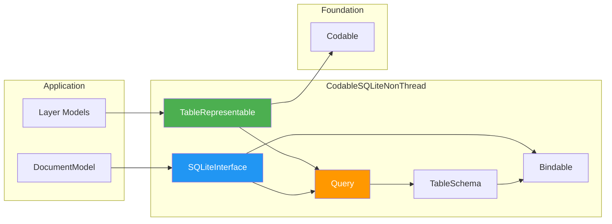
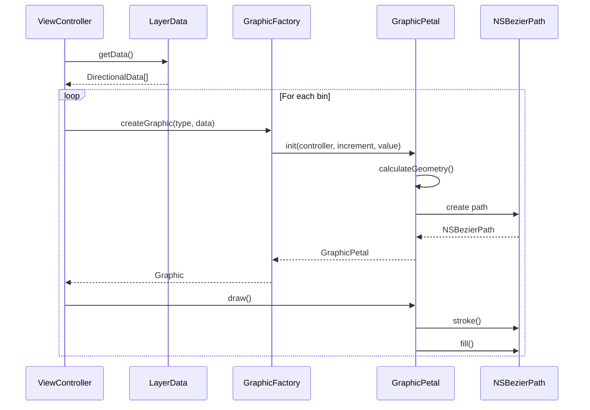
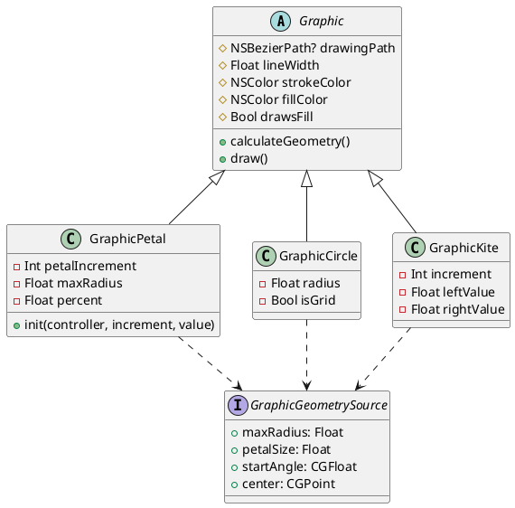
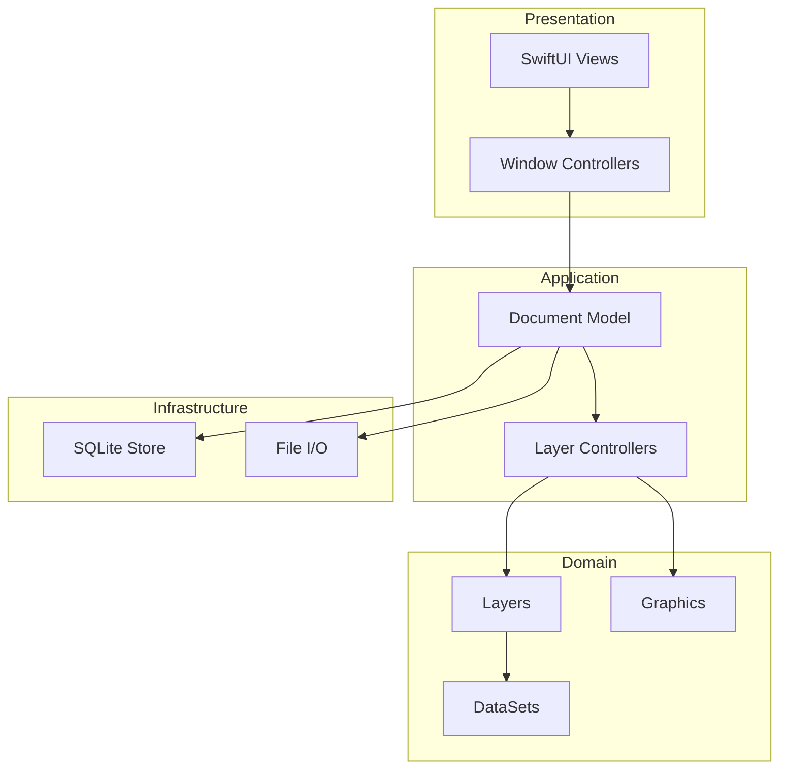

# Architecture Diagram Generator

Generate visual architecture diagrams showing class relationships, dependencies, and system structure.

## Capabilities

1. **Class Diagrams**
   - UML class diagrams with relationships
   - Show inheritance hierarchies
   - Display protocol conformances
   - Include properties and methods

2. **Dependency Graphs**
   - Module dependencies
   - File dependencies
   - Import relationships
   - Circular dependency detection

3. **Data Flow Diagrams**
   - Show data transformation pipelines
   - Visualize state management
   - Document communication patterns
   - Highlight architectural layers

4. **Sequence Diagrams**
   - Method call sequences
   - Object lifecycle
   - Interaction patterns
   - Event flows

5. **Export Formats**
   - Mermaid diagrams
   - PlantUML
   - Graphviz DOT
   - SVG/PNG images

## Workflow

When invoked, this skill will:

1. **Analyze**: Parse code structure and relationships
2. **Organize**: Group related components
3. **Generate**: Create diagram definitions
4. **Render**: Export to visual format
5. **Document**: Add explanatory text

## Usage Instructions

When the user invokes this skill:

1. Ask what to diagram:
   - Class hierarchy
   - Module dependencies
   - Data flow
   - Specific subsystem

2. Choose diagram type:
   - **Class diagram**: Types and relationships
   - **Dependency graph**: Import structure
   - **Sequence diagram**: Runtime interactions
   - **Component diagram**: High-level architecture

3. Select detail level:
   - High-level overview
   - Detailed with all members
   - Specific subsystem focus

4. Generate and render

## Project-Specific Context

Your architecture areas:
- Graphics hierarchy (Graphic → GraphicPetal, etc.)
- Layer system (Layer → LayerCore, LayerData, etc.)
- Database framework (TableRepresentable, SQLiteInterface)
- Document model (DocumentModel, InMemoryStore)

## Diagram Examples

### 1. Graphics Class Hierarchy (Mermaid)



### 2. Layer Storage Hierarchy (Mermaid)



### 3. Document Model Architecture (Mermaid)



### 4. Database Framework Dependencies (Mermaid)



### 5. Graphics Rendering Sequence (Mermaid)



## Generation Scripts

### Swift Code Parser

```swift
import Foundation
import SwiftSyntax
import SwiftParser

struct ClassInfo {
    let name: String
    let superclass: String?
    let protocols: [String]
    let properties: [PropertyInfo]
    let methods: [MethodInfo]
}

struct PropertyInfo {
    let name: String
    let type: String
    let access: String
}

struct MethodInfo {
    let name: String
    let parameters: [String]
    let returnType: String?
    let access: String
}

class ArchitectureDiagramGenerator {
    func parseSwiftFile(_ path: String) -> [ClassInfo] {
        // Parse Swift file using SwiftSyntax
        // Extract class/struct/protocol definitions
        // Build ClassInfo objects
        []
    }

    func generateMermaidClassDiagram(_ classes: [ClassInfo]) -> String {
        var output = "classDiagram\n"

        for classInfo in classes {
            output += "    class \(classInfo.name) {\n"

            // Properties
            for prop in classInfo.properties {
                output += "        \(prop.access)\(prop.type) \(prop.name)\n"
            }

            // Methods
            for method in classInfo.methods {
                let params = method.parameters.joined(separator: ", ")
                let returnType = method.returnType ?? ""
                output += "        \(method.access)\(method.name)(\(params))\(returnType)\n"
            }

            output += "    }\n\n"

            // Inheritance
            if let superclass = classInfo.superclass {
                output += "    \(superclass) <|-- \(classInfo.name)\n"
            }

            // Protocols
            for proto in classInfo.protocols {
                output += "    \(proto) <|.. \(classInfo.name)\n"
            }
        }

        return output
    }

    func generateDependencyGraph(_ directory: String) -> String {
        // Scan import statements
        // Build dependency graph
        // Generate Mermaid or Graphviz
        ""
    }
}
```

### Mermaid to Image Converter

```bash
#!/bin/bash
# convert-diagrams.sh

# Requires mermaid-cli: npm install -g @mermaid-js/mermaid-cli

for file in ./diagrams/*.mmd; do
    name=$(basename "$file" .mmd)
    echo "Converting $name..."

    mmdc -i "$file" \
         -o "./diagrams/$name.svg" \
         -t dark \
         -b transparent

    mmdc -i "$file" \
         -o "./diagrams/$name.png" \
         -t dark \
         -b transparent \
         -w 1920
done

echo "✅ Diagram generation complete"
```

## Automated Generation

### Xcode Build Phase Script

```bash
#!/bin/bash
# Generate architecture diagrams during build

DIAGRAMS_DIR="${PROJECT_DIR}/Documentation/Diagrams"
mkdir -p "$DIAGRAMS_DIR"

# Generate class hierarchy for Graphics
swift run ArchitectureDiagramGenerator \
    --input "${PROJECT_DIR}/PaleoRose/Classes/Graphics" \
    --type class-diagram \
    --output "${DIAGRAMS_DIR}/graphics-hierarchy.mmd"

# Generate layer storage diagram
swift run ArchitectureDiagramGenerator \
    --input "${PROJECT_DIR}/PaleoRose/Classes/Document/Document Model/SQL Models" \
    --type class-diagram \
    --output "${DIAGRAMS_DIR}/layer-storage.mmd"

# Generate dependency graph
swift run ArchitectureDiagramGenerator \
    --input "${PROJECT_DIR}" \
    --type dependencies \
    --output "${DIAGRAMS_DIR}/dependencies.mmd"

# Convert to images
if command -v mmdc &> /dev/null; then
    cd "$DIAGRAMS_DIR"
    for file in *.mmd; do
        mmdc -i "$file" -o "${file%.mmd}.svg"
    done
fi
```

## PlantUML Alternative

### Class Diagram (PlantUML)



## Interactive Diagrams

### D3.js Force-Directed Graph

```html
<!DOCTYPE html>
<html>
<head>
    <title>PaleoRose Architecture</title>
    <script src="https://d3js.org/d3.v7.min.js"></script>
    <style>
        .node { stroke: #fff; stroke-width: 2px; }
        .link { stroke: #999; stroke-opacity: 0.6; }
        text { font: 12px sans-serif; pointer-events: none; }
    </style>
</head>
<body>
    <svg width="1200" height="800"></svg>
    <script>
        const nodes = [
            { id: "DocumentModel", group: "model" },
            { id: "InMemoryStore", group: "model" },
            { id: "SQLiteInterface", group: "storage" },
            { id: "Layer", group: "domain" },
            { id: "LayerCore", group: "domain" },
            { id: "LayerData", group: "domain" },
            { id: "Graphic", group: "graphics" },
            { id: "GraphicPetal", group: "graphics" }
        ];

        const links = [
            { source: "DocumentModel", target: "InMemoryStore" },
            { source: "InMemoryStore", target: "SQLiteInterface" },
            { source: "InMemoryStore", target: "Layer" },
            { source: "Layer", target: "LayerCore" },
            { source: "Layer", target: "LayerData" },
            { source: "Graphic", target: "GraphicPetal" }
        ];

        // D3 force simulation code...
    </script>
</body>
</html>
```

## Documentation Integration

### Embed in DocC

```markdown
# Architecture Overview

PaleoRose follows a layered architecture pattern:


## Graphics Layer

The graphics system is built on a hierarchy of specialized graphic types:


Each graphic type inherits from the base `Graphic` class and implements
custom geometry calculation for its specific visualization type.

## Data Storage

The database layer uses a protocol-oriented approach:


Types conforming to ``TableRepresentable`` can be automatically persisted
to SQLite without manual SQL writing.
```

## Template Diagrams

### High-Level System Overview



## Configuration

Store diagram settings in `.architecture-diagrams.json`:
```json
{
  "outputDirectory": "./Documentation/Diagrams",
  "format": "mermaid",
  "theme": "dark",
  "autoGenerate": true,
  "diagrams": [
    {
      "name": "graphics-hierarchy",
      "type": "class",
      "input": "./PaleoRose/Classes/Graphics",
      "filter": ["Graphic*"]
    },
    {
      "name": "layer-storage",
      "type": "class",
      "input": "./PaleoRose/Classes/Document/Document Model/SQL Models",
      "filter": ["Layer*"]
    },
    {
      "name": "dependencies",
      "type": "dependency-graph",
      "input": "./PaleoRose"
    }
  ]
}
```
