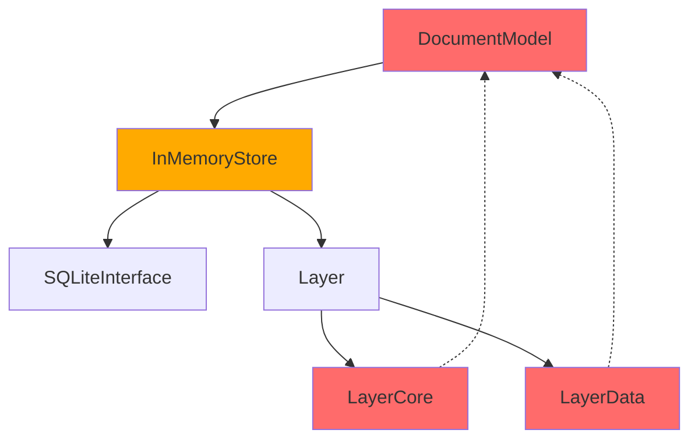

# Dependency Analyzer

Analyze and visualize module dependencies, detect circular dependencies, and suggest decoupling strategies.

## Capabilities

1. **Dependency Mapping**
   - Map import relationships between files
   - Identify module dependencies
   - Track framework dependencies
   - Detect third-party package usage

2. **Circular Dependency Detection**
   - Find circular import chains
   - Identify mutual dependencies
   - Detect indirect cycles
   - Suggest breaking strategies

3. **Coupling Analysis**
   - Measure coupling between modules
   - Calculate fan-in/fan-out metrics
   - Identify God objects/modules
   - Find isolated components

4. **Dependency Graphs**
   - Generate visual dependency graphs
   - Show hierarchical structure
   - Highlight problem areas
   - Export to various formats

5. **Refactoring Suggestions**
   - Suggest dependency injection
   - Recommend protocol extraction
   - Identify facade opportunities
   - Propose modularization strategies

## Workflow

When invoked, this skill will:

1. **Scan**: Parse all source files for imports
2. **Map**: Build dependency graph
3. **Analyze**: Identify issues and metrics
4. **Visualize**: Create dependency diagrams
5. **Recommend**: Suggest improvements

## Usage Instructions

When the user invokes this skill:

1. Ask scope of analysis:
   - Entire project
   - Specific module/framework
   - Between specific directories
   - External dependencies only

2. Choose analysis type:
   - Quick scan (imports only)
   - Deep analysis (symbol usage)
   - Circular dependency check
   - Full architectural review

3. Generate report with:
   - Dependency graph
   - Metrics and statistics
   - Problem areas
   - Recommendations

## Project-Specific Context

Your project structure:
- `PaleoRose` (main app)
- `CodableSQLiteNonThread` (database framework)
- Graphics classes
- Document model
- Layer system

## Analysis Patterns

### 1. Import Analysis

```swift
#!/usr/bin/swift

import Foundation

struct DependencyAnalyzer {
    struct FileImports {
        let filePath: String
        let imports: [String]
    }

    struct DependencyGraph {
        var nodes: Set<String> = []
        var edges: [(from: String, to: String)] = []

        mutating func addEdge(from: String, to: String) {
            nodes.insert(from)
            nodes.insert(to)
            edges.append((from, to))
        }

        func findCycles() -> [[String]] {
            var cycles: [[String]] = []

            for node in nodes {
                if let cycle = findCycleStartingAt(node) {
                    cycles.append(cycle)
                }
            }

            return cycles
        }

        private func findCycleStartingAt(_ start: String) -> [String]? {
            var visited: Set<String> = []
            var path: [String] = []

            func dfs(_ node: String) -> Bool {
                if path.contains(node) {
                    // Found cycle
                    return true
                }

                if visited.contains(node) {
                    return false
                }

                visited.insert(node)
                path.append(node)

                for edge in edges where edge.from == node {
                    if dfs(edge.to) {
                        return true
                    }
                }

                path.removeLast()
                return false
            }

            if dfs(start) {
                return path
            }

            return nil
        }
    }

    func analyzeProject(at path: String) -> DependencyGraph {
        var graph = DependencyGraph()

        let swiftFiles = findSwiftFiles(at: path)

        for file in swiftFiles {
            let imports = extractImports(from: file)

            for imp in imports {
                graph.addEdge(
                    from: fileName(file),
                    to: imp
                )
            }
        }

        return graph
    }

    private func findSwiftFiles(at path: String) -> [String] {
        // Recursively find .swift files
        []
    }

    private func extractImports(from filePath: String) -> [String] {
        guard let content = try? String(contentsOfFile: filePath) else {
            return []
        }

        let pattern = #"import\s+(?:@testable\s+)?(\w+)"#
        guard let regex = try? NSRegularExpression(pattern: pattern) else {
            return []
        }

        let matches = regex.matches(
            in: content,
            range: NSRange(content.startIndex..., in: content)
        )

        return matches.compactMap { match in
            guard let range = Range(match.range(at: 1), in: content) else {
                return nil
            }
            return String(content[range])
        }
    }

    private func fileName(_ path: String) -> String {
        URL(fileURLWithPath: path)
            .deletingPathExtension()
            .lastPathComponent
    }
}

// Usage
let analyzer = DependencyAnalyzer()
let graph = analyzer.analyzeProject(at: "./PaleoRose")

print("Dependencies found:")
print("Nodes: \(graph.nodes.count)")
print("Edges: \(graph.edges.count)")

let cycles = graph.findCycles()
if !cycles.isEmpty {
    print("\n⚠️  Circular dependencies detected:")
    for cycle in cycles {
        print("  \(cycle.joined(separator: " → "))")
    }
}
```

### 2. Dependency Metrics

```swift
struct DependencyMetrics {
    let graph: DependencyGraph

    func fanOut(for node: String) -> Int {
        // Number of outgoing dependencies
        graph.edges.filter { $0.from == node }.count
    }

    func fanIn(for node: String) -> Int {
        // Number of incoming dependencies
        graph.edges.filter { $0.to == node }.count
    }

    func instability(for node: String) -> Double {
        let out = Double(fanOut(for: node))
        let `in` = Double(fanIn(for: node))
        let total = out + `in`

        return total == 0 ? 0 : out / total
    }

    func mostDepended() -> [(String, Int)] {
        // Nodes with highest fan-in
        graph.nodes.map { node in
            (node, fanIn(for: node))
        }
        .sorted { $0.1 > $1.1 }
    }

    func mostDependencies() -> [(String, Int)] {
        // Nodes with highest fan-out
        graph.nodes.map { node in
            (node, fanOut(for: node))
        }
        .sorted { $0.1 > $1.1 }
    }

    func isolatedModules() -> [String] {
        // Nodes with no dependencies
        graph.nodes.filter { node in
            fanIn(for: node) == 0 && fanOut(for: node) == 0
        }
    }

    func generateReport() -> String {
        """
        # Dependency Analysis Report

        ## Summary
        - Total modules: \(graph.nodes.count)
        - Total dependencies: \(graph.edges.count)
        - Circular dependencies: \(graph.findCycles().count)

        ## Most Depended Upon Modules
        \(formatTop(mostDepended(), prefix: "←"))

        ## Modules with Most Dependencies
        \(formatTop(mostDependencies(), prefix: "→"))

        ## Instability Metrics
        \(instabilityReport())

        ## Isolated Modules
        \(isolatedModules().joined(separator: "\n"))
        """
    }

    private func formatTop(
        _ items: [(String, Int)],
        prefix: String
    ) -> String {
        items.prefix(10).map { name, count in
            "\(prefix) \(name): \(count)"
        }.joined(separator: "\n")
    }

    private func instabilityReport() -> String {
        graph.nodes
            .map { node in
                (node, instability(for: node))
            }
            .sorted { $0.1 > $1.1 }
            .prefix(10)
            .map { name, inst in
                "  \(name): \(String(format: "%.2f", inst))"
            }
            .joined(separator: "\n")
    }
}
```

### 3. Circular Dependency Detection

```swift
struct CircularDependencyDetector {
    let graph: DependencyGraph

    struct Cycle {
        let nodes: [String]

        var description: String {
            nodes.joined(separator: " → ") + " → " + (nodes.first ?? "")
        }

        var length: Int {
            nodes.count
        }
    }

    func detectCycles() -> [Cycle] {
        var cycles: [Cycle] = []
        var visited: Set<String> = []

        for node in graph.nodes {
            if !visited.contains(node) {
                detectCyclesFrom(
                    node,
                    path: [],
                    visited: &visited,
                    cycles: &cycles
                )
            }
        }

        return cycles
    }

    private func detectCyclesFrom(
        _ node: String,
        path: [String],
        visited: inout Set<String>,
        cycles: inout [Cycle]
    ) {
        if path.contains(node) {
            // Found cycle
            let cycleStart = path.firstIndex(of: node)!
            let cycleNodes = Array(path[cycleStart...])
            cycles.append(Cycle(nodes: cycleNodes))
            return
        }

        if visited.contains(node) {
            return
        }

        visited.insert(node)
        var newPath = path
        newPath.append(node)

        // Follow dependencies
        for edge in graph.edges where edge.from == node {
            detectCyclesFrom(
                edge.to,
                path: newPath,
                visited: &visited,
                cycles: &cycles
            )
        }
    }

    func suggestBreaking(_ cycle: Cycle) -> [String] {
        var suggestions: [String] = []

        // Suggest breaking at weakest link
        for i in 0..<cycle.length {
            let from = cycle.nodes[i]
            let to = cycle.nodes[(i + 1) % cycle.length]

            suggestions.append(
                """
                Break dependency: \(from) → \(to)
                - Extract protocol from \(to)
                - Make \(from) depend on protocol instead
                - Use dependency injection
                """
            )
        }

        return suggestions
    }
}
```

### 4. Dependency Graph Visualization

```swift
struct DependencyGraphVisualizer {
    let graph: DependencyGraph

    func generateMermaid() -> String {
        var output = "graph TD\n"

        // Add edges
        for edge in graph.edges {
            output += "    \(sanitize(edge.from)) --> \(sanitize(edge.to))\n"
        }

        // Highlight cycles
        let cycles = graph.findCycles()
        for cycle in cycles {
            for i in 0..<cycle.count {
                let from = cycle[i]
                let to = cycle[(i + 1) % cycle.count]
                output += "    style \(sanitize(from)) fill:#ff6b6b\n"
            }
        }

        return output
    }

    func generateGraphviz() -> String {
        var output = "digraph Dependencies {\n"
        output += "    rankdir=LR;\n"
        output += "    node [shape=box];\n"

        // Add edges
        for edge in graph.edges {
            output += "    \"\(edge.from)\" -> \"\(edge.to)\";\n"
        }

        // Highlight high-dependency nodes
        let metrics = DependencyMetrics(graph: graph)
        for (node, _) in metrics.mostDepended().prefix(5) {
            output += "    \"\(node)\" [style=filled, fillcolor=lightblue];\n"
        }

        output += "}\n"
        return output
    }

    private func sanitize(_ name: String) -> String {
        name.replacingOccurrences(of: " ", with: "_")
            .replacingOccurrences(of: "-", with: "_")
    }
}
```

## Example Reports

### Dependency Report for PaleoRose

```markdown
# PaleoRose Dependency Analysis

## Summary
- Total modules: 127
- Total dependencies: 342
- Average dependencies per module: 2.7
- Circular dependencies: 2

## Circular Dependencies

### Cycle 1: DocumentModel ↔ InMemoryStore
```
DocumentModel → InMemoryStore → Layer → DocumentModel
```

**Recommendation:**
- Extract `StoreProtocol` interface
- Make `DocumentModel` depend on protocol instead
- Use dependency injection

### Cycle 2: Graphics Hierarchy
```
GraphicPetal → GraphicGeometrySource → XRLayerData → GraphicPetal
```

**Recommendation:**
- Move `GraphicGeometrySource` to separate file
- Create pure data transfer objects
- Break Obj-C bridge dependencies

## Most Depended Upon Modules

1. Foundation (67 dependents)
2. AppKit (45 dependents)
3. TableRepresentable (23 dependents)
4. Graphic (18 dependents)
5. DocumentModel (15 dependents)

## Modules with Most Dependencies

1. DocumentModel (12 dependencies)
   - InMemoryStore, SQLiteInterface, Layer, LayerCore, LayerData, ...
   - **Suggestion:** Consider splitting responsibilities

2. XRoseWindowController (10 dependencies)
   - **Suggestion:** Use coordinator pattern

3. GraphicPetal (8 dependencies)
   - **Suggestion:** Extract geometry calculations

## Instability Index

High instability (more dependencies than dependents):
- XRoseDocument: 0.92
- GraphicHistogram: 0.88
- LayerText: 0.85

Low instability (more dependents than dependencies):
- TableRepresentable: 0.12
- Graphic: 0.18
- Layer: 0.23

## Isolated Modules

Modules with no dependencies (potential for extraction):
- UserDefaultsKey
- Logger
- CommonUtilities
```

### Visualization Example



## Refactoring Strategies

### 1. Break Circular Dependencies

```swift
// Before: Circular dependency
// DocumentModel.swift
class DocumentModel {
    let store: InMemoryStore

    func load() {
        store.loadLayers(for: self)
    }
}

// InMemoryStore.swift
class InMemoryStore {
    func loadLayers(for model: DocumentModel) {
        let layers = query()
        model.updateLayers(layers)  // Creates cycle!
    }
}

// After: Use protocol
// StoreProtocol.swift
protocol DataStore {
    func loadLayers() -> [Layer]
}

// DocumentModel.swift
class DocumentModel {
    let store: DataStore  // Protocol, not concrete type

    func load() {
        let layers = store.loadLayers()
        updateLayers(layers)
    }
}

// InMemoryStore.swift
class InMemoryStore: DataStore {
    func loadLayers() -> [Layer] {
        return query()  // No reference to DocumentModel
    }
}
```

### 2. Extract Shared Protocols

```swift
// Before: Multiple modules depend on concrete types
import GraphicPetal  // Heavy import just for geometry

func calculateLayout() {
    let geom = GraphicPetal(...)
    let center = geom.center
}

// After: Depend on lightweight protocol
protocol GeometryProviding {
    var center: CGPoint { get }
    var maxRadius: Float { get }
}

func calculateLayout(geometry: GeometryProviding) {
    let center = geometry.center
}
```

### 3. Use Dependency Injection

```swift
// Before: Direct dependency
class XRoseWindowController {
    let model = DocumentModel()  // Hard-coded dependency

    func save() {
        model.save()
    }
}

// After: Injected dependency
class XRoseWindowController {
    let model: DocumentModel

    init(model: DocumentModel) {
        self.model = model
    }

    func save() {
        model.save()
    }
}
```

## Command Line Tool

```bash
#!/bin/bash
# analyze-dependencies.sh

echo "🔍 Analyzing PaleoRose dependencies..."

# Run analyzer
swift run DependencyAnalyzer \
    --input ./PaleoRose \
    --output ./Reports/dependencies.md \
    --format markdown

# Generate graph
swift run DependencyAnalyzer \
    --input ./PaleoRose \
    --output ./Reports/dependencies.mmd \
    --format mermaid

# Convert to image
if command -v mmdc &> /dev/null; then
    mmdc -i ./Reports/dependencies.mmd \
         -o ./Reports/dependencies.svg
fi

# Check for circular dependencies
if swift run DependencyAnalyzer --check-cycles --input ./PaleoRose; then
    echo "✅ No circular dependencies detected"
else
    echo "⚠️  Circular dependencies found - see report"
    exit 1
fi
```

## Configuration

Store analyzer settings in `.dependency-analyzer.json`:
```json
{
  "excludedPaths": [
    "*/Tests/*",
    "*/Build/*",
    "*/.build/*",
    "*/Pods/*"
  ],
  "excludedModules": [
    "Foundation",
    "AppKit",
    "SwiftUI"
  ],
  "reportFormat": "markdown",
  "generateGraph": true,
  "highlightCycles": true,
  "metricsThresholds": {
    "maxFanOut": 10,
    "maxFanIn": 20,
    "maxCycleLength": 3
  }
}
```
